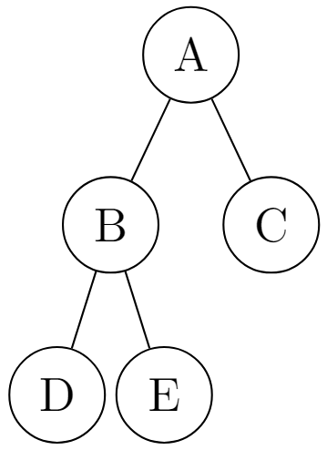
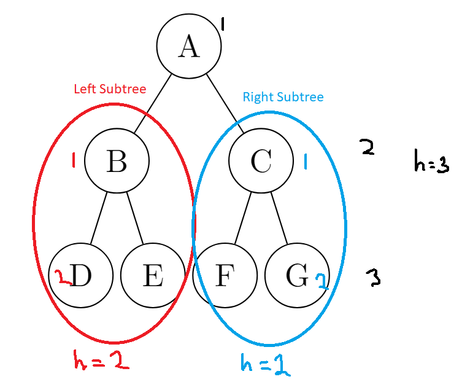

# Balanced Binary Tree

## Overview

> Quoting from [Binary_Tree_DS.md](./Balanced_Binary_Tree_DS.md):
>
> *A type of binary trees where the height of the binary is $O(log\ H)$ where $H$ is the height of the binary tree.*

The above definition can then be redefined as such $H\in{}O(log\ n)$ where $H$ is the height and $n$ is the number of nodes.



<details>
<summary>LaTeX Source</summary>

```tex
\documentclass[margin=4mm]{standalone}
\usepackage[edges]{forest}
\usepackage{tikz-qtree}
\begin{document}
\tikzset{every tree node/.style={minimum width=2em,draw,circle},
         blank/.style={draw=none},
         edge from parent/.style=
         {draw,edge from parent path={(\tikzparentnode) -- (\tikzchildnode)}},
         level distance=1.25cm}
\begin{tikzpicture}
\Tree
[.A
    \edge[]; [.B
        \edge[]; {D}
        \edge[]; \node[]{E};
    ]
    \edge[]; \node[]{C};
]
\end{tikzpicture}
\end{document}
```

</details>

## Properties

1. Operations like lookup, insert, and find_min cost $O(log\ n)$

## Height-Balanced Binary Tree & Self Balancing Binary Tree

This is the most common form of Balanced Binary Trees and follows the following conditions:

### The heights of all right and left subtrees of every node differ by **at most 1**. (*Height invariance condition*)

> **Recall that the height of a tree is defined as the maximum number of edges from the root a leaf**

#### Here are some balanced trees that satisfies the height-invariance condition



