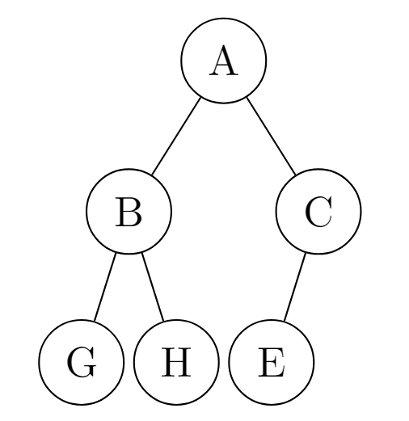
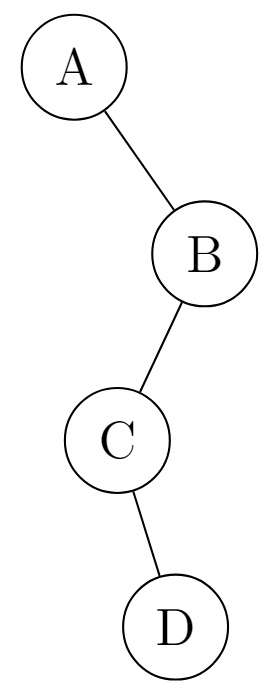
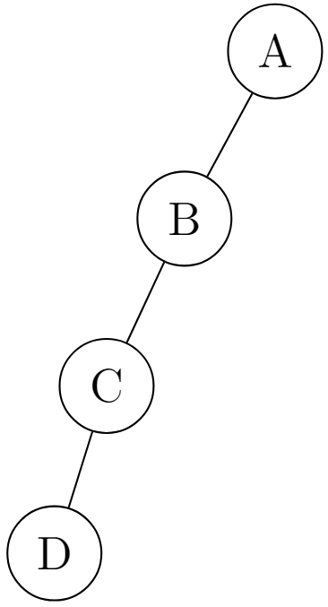

# Binary Tree

## Overview

A Binary Tree is a type of [tree data structure](./Tree_DS.md) where all nodes except the last layer has at most 2 children known as (*left* and *right*).
> *There are terminology for trees that are covered [here](./Tree_DS.md)*.


<details>

<summary>LaTeX Source</summary>

```tex
\documentclass[margin=3mm]{standalone}
\usepackage[edges]{forest}
\begin{document}
    \begin{forest}
for tree={
    grow=south,
    circle, draw, minimum size=3ex, inner sep=1pt,
    s sep=3mm
        }
[[[[][]][[][]]][[[][]][[][]]]]
\end{forest}
\end{document}
```

</details>

### Properties

1. **The maximum nodes at a level $L$ is $2^L$**
2. **The maximum nodes for a binary tree with height $H$ is $2^H-1$**
3. **The minimum possible levels/height in a binary tree with $N$ nodes is $log_2(N+1)$**
4. **A binary tree with $T$ leaves has at least $|log_2(T)|+1$ levels$**
5. **Given a non-empty binary tree of $N$ nodes, the number of edges $E=N-1$**

## Types

### Complete Binary Tree

1. Every level except the last level is completely filled
2. All nodes on the last level must be as left as possible


<details>
<summary>LaTeX Source</summary>

```tex
\documentclass[margin=4mm]{standalone}
\usepackage[edges]{forest}
\usepackage{tikz-qtree}
\begin{document}
\tikzset{every tree node/.style={minimum width=2em,draw,circle},
         blank/.style={draw=none},
         edge from parent/.style=
         {draw,edge from parent path={(\tikzparentnode) -- (\tikzchildnode)}},
         level distance=1.25cm}
\begin{tikzpicture}
\Tree
[.A
    [.B 
    \edge[]; \node[]{G};
    \edge[]; \node[]{H};
    ]
    [.C 
    \edge[]; \node[]{E};
    \edge[blank]; \node[blank]{};
    ]
]
\end{tikzpicture}
\end{document}
```

</details>

### Full Binary Tree

1. All nodes (excluding leaves but including the root &mdash; [internal nodes](./Tree_DS.md#terminology)) have $0$ **or** $2$ children.


<details>
<summary>LaTeX Source</summary>

```tex
\documentclass[margin=4mm]{standalone}
\usepackage[edges]{forest}
\usepackage{tikz-qtree}
\begin{document}
\tikzset{every tree node/.style={minimum width=2em,draw,circle},
         blank/.style={draw=none},
         edge from parent/.style=
         {draw,edge from parent path={(\tikzparentnode) -- (\tikzchildnode)}},
         level distance=1.25cm}
\begin{tikzpicture}
\Tree
[.A
    [.B 
    \edge[]; \node[]{G};
    \edge[]; \node[]{H};
    ]
    [.C 
    \edge[]; \node[]{E};
    \edge[]; \node[]{D};
    ]
]
\end{tikzpicture}
\end{document}
```

</details>

### Degenerate/Pathological Tree

All nodes in the tree have only one child that is either left or right.

> *They are the same as a normal linked list and offer the same performance as them.*


<details>
<summary>LaTeX Source</summary>

```tex
\documentclass[margin=4mm]{standalone}
\usepackage[edges]{forest}
\usepackage{tikz-qtree}
\begin{document}
\tikzset{every tree node/.style={minimum width=2em,draw,circle},
         blank/.style={draw=none},
         edge from parent/.style=
         {draw,edge from parent path={(\tikzparentnode) -- (\tikzchildnode)}},
         level distance=1.25cm}
\begin{tikzpicture}
\Tree
[.A
    \edge[blank]; \node[blank]{};
    \edge[]; [.B
        \edge[]; [.C
            \edge[blank]; \node[blank]{};
            \edge[]; {D}
        ]
        \edge[blank]; \node[blank]{};
    ]
]
\end{tikzpicture}
\end{document}
```

</details>

### Perfect Binary Tree

A type of [full binary tree](#full-binary-tree) where all nodes have 2 children and the leaf nodes are all at the same level.


<details>
<summary>LaTeX Source</summary>

```tex
\documentclass[margin=4mm]{standalone}
\usepackage[edges]{forest}
\usepackage{tikz-qtree}
\begin{document}
\tikzset{every tree node/.style={minimum width=2em,draw,circle},
         blank/.style={draw=none},
         edge from parent/.style=
         {draw,edge from parent path={(\tikzparentnode) -- (\tikzchildnode)}},
         level distance=1.25cm}
\begin{tikzpicture}
\Tree
[.A
    [.B 
    \edge[]; \node[]{G};
    \edge[]; \node[]{H};
    ]
    [.C 
    \edge[]; \node[]{E};
    \edge[]; \node[]{D};
    ]
]
\end{tikzpicture}
\end{document}
```

</details>

### Skewed Binary Tree

A binary tree where all nodes have either **only** left or **only** right child nodes.


<details>
<summary>LaTeX Source</summary>

```tex
\documentclass[margin=4mm]{standalone}
\usepackage[edges]{forest}
\usepackage{tikz-qtree}
\begin{document}
\tikzset{every tree node/.style={minimum width=2em,draw,circle},
         blank/.style={draw=none},
         edge from parent/.style=
         {draw,edge from parent path={(\tikzparentnode) -- (\tikzchildnode)}},
         level distance=1.25cm}
\begin{tikzpicture}
\Tree
[.A
    \edge[]; [.B
        \edge[]; [.C
            \edge[]; {D}
            \edge[blank]; \node[blank]{};
        ]
        \edge[blank]; \node[blank]{};
    ]
    \edge[blank]; \node[blank]{};
]
\end{tikzpicture}
\end{document}
```

</details>


### Balanced Binary Tree

A type of binary trees where the height of the binary is $O(log\ H)$ where $H$ is the height of the binary tree. **Read more [here](./Balanced_Binary_Tree_DS.md)**


<details>
<summary>LaTeX Source</summary>

```tex
\documentclass[margin=4mm]{standalone}
\usepackage[edges]{forest}
\usepackage{tikz-qtree}
\begin{document}
\tikzset{every tree node/.style={minimum width=2em,draw,circle},
         blank/.style={draw=none},
         edge from parent/.style=
         {draw,edge from parent path={(\tikzparentnode) -- (\tikzchildnode)}},
         level distance=1.25cm}
\begin{tikzpicture}
\Tree
[.A
    \edge[]; [.B
        \edge[]; {D}
        \edge[]; \node[]{E};
    ]
    \edge[]; \node[]{C};
]
\end{tikzpicture}
\end{document}
```

</details>
