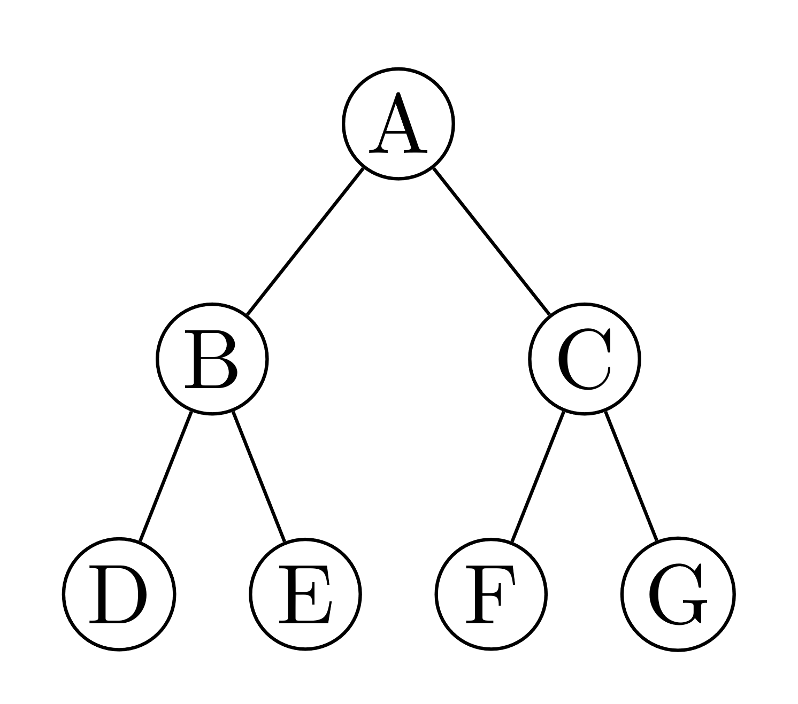
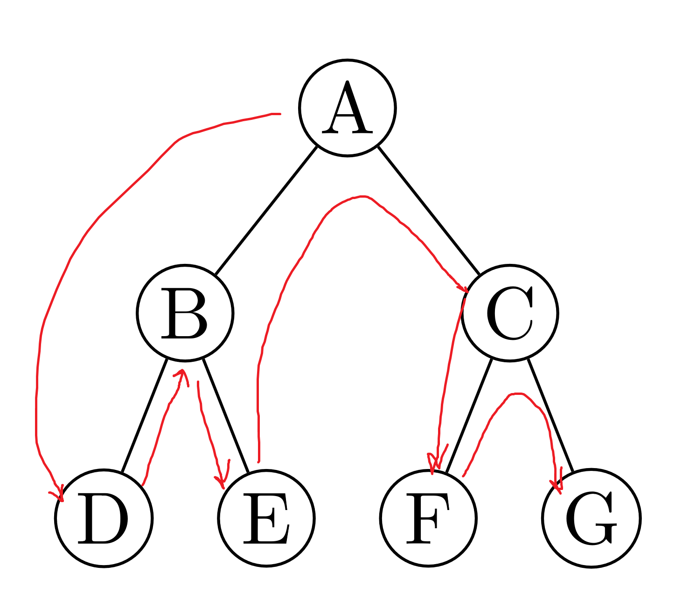
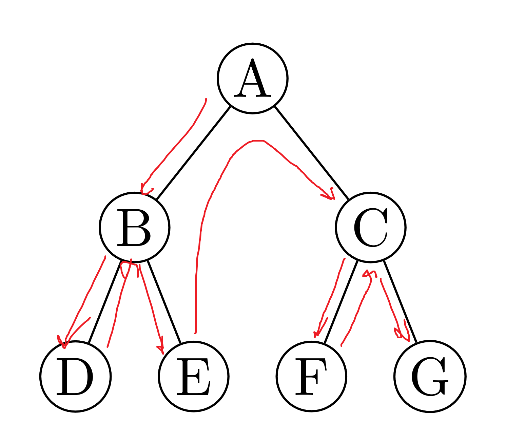
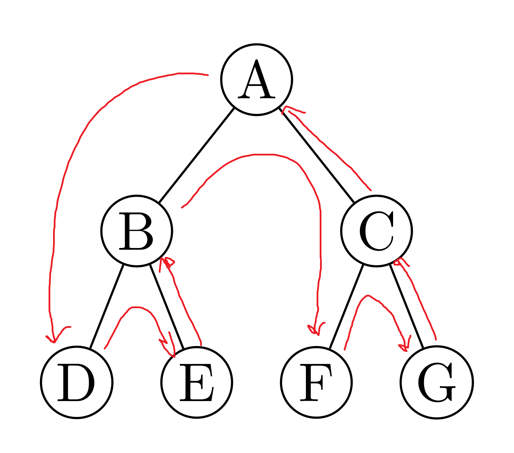
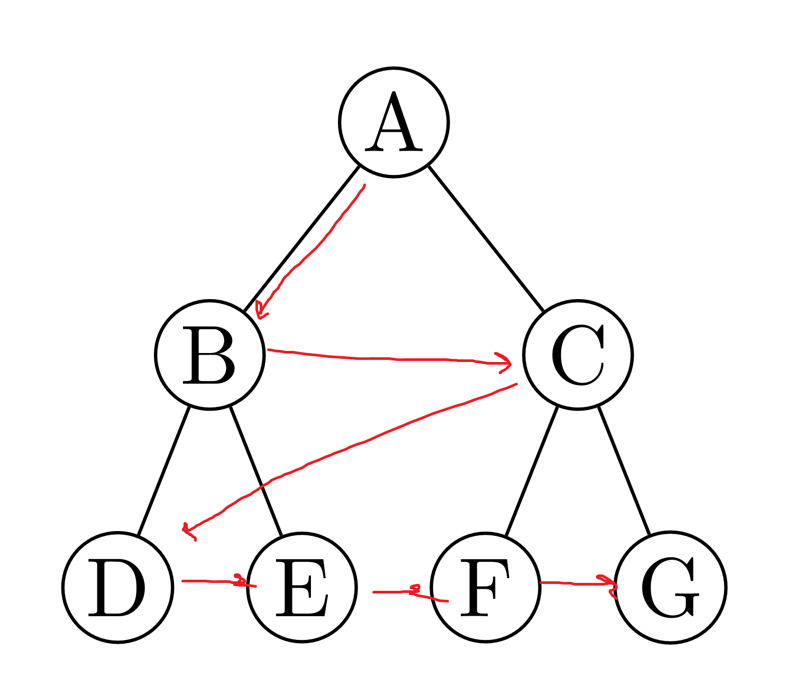

# Tree Traversal

Trees as compared to other data structures like queues, stacks, linked-lists, etc. are non-linear meaning there are multiple ways to traverse them. Traversing them means we need a certain algorithm to be able to visit all or some of the nodes.



<details>
<summary>LaTeX Source</summary>

```tex
\documentclass[margin=3mm]{standalone}
\usepackage[edges]{forest}
\begin{document}
    \begin{forest}
for tree={
    grow=south,
    circle, 
    draw, 
    minimum size=3ex, 
    inner sep=1pt,
    s sep=3mm
}
[A
    [B
        [D [,no edge, draw=none]]
        [E [,no edge, draw=none]]
    ]
    [C
        [F [,no edge, draw=none]]
        [G [,no edge, draw=none]]
    ]
]
    \end{forest}
\end{document}
```

</details>

There are two main ways to traverse a tree:

1. **Depth-First Search** (DFS)
2. **Breadth-First Search** (BFS) or **Level-Order** Traversal

Here is a quick visual I found to be helpful (DFS is on the left, BFS is on the right):


## Table of Contents

- [Tree Traversal](#tree-traversal)
   * [Depth-First Search](#depthfirst-search)
      + [In-Order Traversal](#inorder-traversal)
         - [C++ Snippet #1](#c-snippet-1)
         - [C++ Snippet #2](#c-snippet-2)
      + [Pre-Order Traversal](#preorder-traversal)
         - [C++ Snippet #1](#c-snippet-1-1)
         - [C++ Snippet #2](#c-snippet-2-1)
      + [Post-Order Traversal](#postorder-traversal)
         - [C++ Snippet #1](#c-snippet-1-2)
         - [C++ Snippet #2](#c-snippet-2-2)
   * [Breadth-First Search (BFS) / Level Order Traversal](#breadthfirst-search-bfs-level-order-traversal)
      + [C++ Snippet](#c-snippet)
   * [References](#references)

## Depth-First Search

This traversal technique is known as *depth* first search because it prioritizes searching a given root/path as far as possible (depth) before *backtracking.* With this method, there are 3 approaches:

1. **In-Order Traversal**
2. **Pre-Order Traversal**
3. **Post-Order Traversal**

Most of these methods are implemented using **recursion**.

A general note quoted from the **Competitive Programming Handbook**

> *Depth-first search (DFS) is a straightforward graph traversal technique. The algorithm begins at a starting node, and proceeds to all other nodes that are reachable from the starting node using the edges of the graph. **Depth-first search always follows a single path in the graph as long as it finds new nodes.** After this, it returns to previous nodes and begins to explore other parts of the graph. The algorithm keeps track of visited nodes, so that it processes each node only once.*

### In-Order Traversal

This traversal method involves visiting the following steps:

1. Start the most left node on the left subtree
2. Traverse the left subtree and visit nodes
3. Traverse the root node and visit nodes
4. Traverse the right subtree starting from the left most node

> A good rule of thumb is thus **LEFT->VISIT->RIGHT** (LVR)

Looking at the above tree:


An In-Order Traversal will see the following nodes in this order:



$\texttt{D}\rightarrow \texttt{B}\rightarrow \texttt{E}\rightarrow \texttt{A}\rightarrow \texttt{F}\rightarrow \texttt{C}\rightarrow \texttt{G}$

---

#### C++ Snippet #1

```cpp
struct Node 
{
    Node* left;
    Node* right;
    int val;
    Node(Node* left,Node* right,int val):left(left),right(right),val(val) 
    {
    }
};
void inOrder(Node* root)
{
    if(root==nullptr)
        return;
    inOrder(root->left);
    std::cout<<root->val<<std::endl;
    inOrder(root->right);
}
```

#### C++ Snippet #2

```cpp
struct Node 
{
    Node* left;
    Node* right;
    int val;
    Node(Node* left,Node* right,int val):left(left),right(right),val(val) 
    {
    }
};
void inOrder(std::vector<int>& vals,Node* root)
{
    if(root==nullptr)
        return;
    inOrder(root->left);
    vals.push_back(root->val);
    inOrder(root->right);
}
int main(void)
{
    Node* root=new Node(nullptr,nullptr,1);
    ...
    Code to construct tree nodes
    ...
    std::vector<int> res;
    inOrder(res,root);
    for(int&x:res)
        std::cout<<x<<std::endl;
}
```

---

Here is an animated visual:


### Pre-Order Traversal

This traversal method is similar to [In Order Traversal](#in-order-traversal) but we visit the node before we traverse:

1. Visit the current node (starting with the root node)
2. Traverse the left subtree with the left most node
3. Traverse the right subtree with the left mode node

> This gives us a good rule of thumb of **VISIT->LEFT->RIGHT** (VLR)

Using the previous tree:


A pre-order traversal would look like this:



$\texttt{A}\rightarrow \texttt{B}\rightarrow \texttt{D}\rightarrow \texttt{E}\rightarrow \texttt{C}\rightarrow \texttt{F}\rightarrow \texttt{G}$

---

#### C++ Snippet #1

```cpp
struct Node 
{
    Node* left;
    Node* right;
    int val;
    Node(Node* left,Node* right,int val):left(left),right(right),val(val) 
    {
    }
};
void preOrder(Node* root)
{
    if(root==nullptr)
        return;
    std::cout<<root->val<<std::endl; // Notice how the implementation just requires moving this accessing part
    preOrder(root->left);
    preOrder(root->right);
}
```

#### C++ Snippet #2

```cpp
struct Node 
{
    Node* left;
    Node* right;
    int val;
    Node(Node* left,Node* right,int val):left(left),right(right),val(val) 
    {
    }
};
void preOrder(std::vector<int>& vals,Node* root)
{
    if(root==nullptr)
        return;
    vals.push_back(root->val);
    preOrder(root->left);
    preOrder(root->right);
}
int main(void)
{
    Node* root=new Node(nullptr,nullptr,1);
    ...
    Code to construct tree nodes
    ...
    std::vector<int> res;
    inOrder(res,root);
    for(int&x:res)
        std::cout<<x<<std::endl;
}
```

--- 

Here is an animated visual:


### Post-Order Traversal

This traversal method similar to the other variations of DFS but follows these steps:

1. Traverse the left subtree and visit each node
2. Traverse the right subtree and visit each node
3. Visit the root node 

> This gives us the rule of thumb of **LEFT->RIGHT->VISIT** (LRV)

The example tree given previously:


A post-order traversal would look like this:



$\texttt{D}\rightarrow \texttt{E}\rightarrow \texttt{B}\rightarrow \texttt{F}\rightarrow \texttt{G}\rightarrow \texttt{C}\rightarrow \texttt{A}$

---

#### C++ Snippet #1

```cpp
struct Node 
{
    Node* left;
    Node* right;
    int val;
    Node(Node* left,Node* right,int val):left(left),right(right),val(val) 
    {
    }
};
void postOrder(Node* root)
{
    if(root==nullptr)
        return;
    postOrder(root->left);
    postOrder(root->right);
    std::cout<<root->val<<std::endl;
}
```

#### C++ Snippet #2

```cpp
struct Node 
{
    Node* left;
    Node* right;
    int val;
    Node(Node* left,Node* right,int val):left(left),right(right),val(val) 
    {
    }
};
void postOrder(std::vector<int>& vals,Node* root)
{
    if(root==nullptr)
        return;
    postOrder(root->left);
    postOrder(root->right);
    vals.push_back(root->val);
}
int main(void)
{
    Node* root=new Node(nullptr,nullptr,1);
    ...
    Code to construct tree nodes
    ...
    std::vector<int> res;
    postOrder(res,root);
    for(int&x:res)
        std::cout<<x<<std::endl;
}
```

--- 

Here is an animated visual:


## Breadth-First Search (BFS) / Level Order Traversal

As compared to DFS which prioritizes the depth when going through a tree, BFS prioritizes first looking at all of the nodes that is on one level. This traversal method is also much harder to implement as compared to DFS. 

> *To put into graph theory this means that BFS first traverses all nodes with the same distance $x$ from the originating vertex.*

The example tree given previously:


BFS would look like this:



$\texttt{A}\rightarrow \texttt{B}\rightarrow \texttt{C}\rightarrow \texttt{D}\rightarrow \texttt{E}\rightarrow \texttt{F}\rightarrow \texttt{G}$

Furthermore, BFS requires the usage of a data structure known as a [**Queue**](./Queue_DS.md).

---

### C++ Snippet

```cpp
struct Node 
{
    Node* left;
    Node* right;
    int val;
    Node(Node* left,Node* right,int val):left(left),right(right),val(val) 
    {
    }
};
vector<int> bfs(Node* root)
{
    if(root==nullptr)
        return {};
    vector<int> res;
    queue<Node*> q;
    q.push(root);
    while(!q.empty())
    {
        Node* curr=q.front();
        q.pop();
        res.push_back(curr);
        if(curr->left!=nullptr)
            q.push(curr->left);
        if(curr->right!=nullptr)
            q.push(curr->right);
    }
    return res;
}
```

---

Here is an animated visual:


## References

1. [https://usaco.guide/silver/graph-traversal](https://usaco.guide/silver/graph-traversal)
2. [https://www.cs.cornell.edu/courses/JavaAndDS/dfs/dfs01develop.pdf](https://www.cs.cornell.edu/courses/JavaAndDS/dfs/dfs01develop.pdf)
3. [https://builtin.com/software-engineering-perspectives/tree-traversal](https://builtin.com/software-engineering-perspectives/tree-traversal)